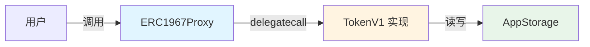
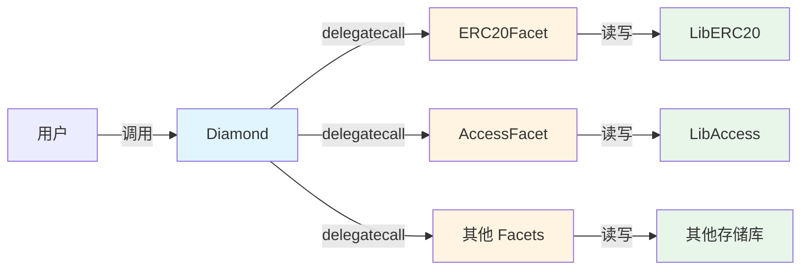

# 架构概览

本文档介绍 Foundry Upgradeable Storage Template 的整体架构设计和核心理念。

---

## 🎯 项目目标

### 核心问题

可升级智能合约最大的风险不是代码逻辑错误，而是**存储布局冲突**：

```solidity
// ❌ 错误示例：V2 改变了存储布局
contract TokenV1 {
    address public owner;      // slot 0
    uint256 public totalSupply; // slot 1
}

contract TokenV2 {
    uint256 public totalSupply; // slot 0 ⚠️ 冲突！
    address public owner;       // slot 1 ⚠️ 冲突！
}
```

升级到 V2 后，`owner` 和 `totalSupply` 的数据会互换，导致灾难性后果。

### 解决方案

本模板通过以下机制防止存储冲突：

1. **命名存储槽** - 使用 keccak256 哈希作为存储位置
2. **存储库模式** - 集中定义存储结构
3. **自动化测试** - 检测状态变量和布局变化
4. **Facet 隔离** - Diamond 模式中的存储命名空间

---

## 🏗️ 架构模式对比

本项目实现了两种主流的可升级合约模式：

### 1. UUPS Proxy (EIP-1967)



**特点**：
- ✅ 简单直观
- ✅ Gas 成本低
- ✅ 适合单一逻辑合约
- ⚠️ 升级逻辑在实现合约中

**适用场景**：
- 单一功能的代币合约
- 简单的 DeFi 协议
- 需要频繁升级的合约

---

### 2. Diamond Pattern (EIP-2535)



**特点**：
- ✅ 模块化设计
- ✅ 突破合约大小限制（24KB）
- ✅ 可独立升级各个 facet
- ✅ 存储完全隔离
- ⚠️ 复杂度较高

**适用场景**：
- 大型 DeFi 协议
- 多功能平台
- 需要模块化管理的系统

---

## 🔐 存储安全策略

### 命名存储槽（Named Storage）

使用 keccak256 哈希确定存储位置，避免冲突：

```solidity
library AppStorage {
    // 使用唯一的命名空间
    bytes32 internal constant STORAGE_SLOT = 
        keccak256("app.storage.v1");
    
    struct Layout {
        address owner;
        uint256 totalSupply;
        mapping(address => uint256) balances;
    }
    
    function layout() internal pure returns (Layout storage l) {
        bytes32 slot = STORAGE_SLOT;
        assembly {
            l.slot := slot
        }
    }
}
```

**优势**：
- 🔒 存储位置固定，不受合约变量顺序影响
- 🔒 不同命名空间之间完全隔离
- 🔒 升级时只需修改 Layout 结构体

---

### 存储库模式（Storage Library Pattern）

将存储定义与业务逻辑分离：

```solidity
// 存储定义（永远不变）
library LibERC20 {
    bytes32 constant STORAGE_POSITION = keccak256("diamond.erc20.storage");
    
    struct Layout {
        uint256 totalSupply;
        mapping(address => uint256) balanceOf;
    }
    
    function layout() internal pure returns (Layout storage l) {
        bytes32 pos = STORAGE_POSITION;
        assembly { l.slot := pos }
    }
}

// 业务逻辑（可升级）
contract ERC20Facet {
    function mint(address to, uint256 amount) external {
        LibERC20.Layout storage s = LibERC20.layout();
        s.totalSupply += amount;
        s.balanceOf[to] += amount;
    }
}
```

---

## 🧪 自动化检测机制

### 1. 存储布局测试

检测实现合约是否定义了状态变量：

```solidity
function test_tokenV1_has_no_state_variables() public view {
    string memory json = vm.readFile("out/TokenV1.sol/TokenV1.json");
    bytes memory layoutBytes = vm.parseJson(json, ".storageLayout.storage");
    
    // 空数组的 ABI 编码是 64 字节
    assertEq(layoutBytes.length, 64, "TokenV1 defines state variables");
}
```

### 2. Facet 状态检测

确保 Diamond facets 没有状态变量：

```solidity
function test_facets_have_no_state_variables() public view {
    string[2] memory facets = ["ERC20Facet", "AccessFacet"];
    
    for (uint256 i = 0; i < facets.length; i++) {
        string memory json = vm.readFile(
            string.concat("out/", facets[i], ".sol/", facets[i], ".json")
        );
        bytes memory layoutBytes = vm.parseJson(json, ".storageLayout.storage");
        assertEq(layoutBytes.length, 64, "Facet has state variables");
    }
}
```

### 3. 命名空间冲突检测

验证不同存储库使用不同的命名空间：

```solidity
function test_unique_storage_namespaces() public {
    bytes32 diamond = keccak256("diamond.standard.diamond.storage");
    bytes32 erc20 = keccak256("diamond.erc20.storage");
    bytes32 access = keccak256("diamond.access.storage");
    
    assert(diamond != erc20);
    assert(diamond != access);
    assert(erc20 != access);
}
```

---

## 📊 架构决策对比

| 特性 | UUPS Proxy | Diamond |
|------|-----------|---------|
| **复杂度** | 低 | 中-高 |
| **Gas 成本** | 低 | 中等 |
| **合约大小限制** | 24KB | 无限制 |
| **模块化** | 否 | 是 |
| **升级粒度** | 整个实现 | 单个 facet |
| **存储隔离** | 单一命名空间 | 多命名空间 |
| **学习曲线** | 平缓 | 陡峭 |

---

## 🎯 选择指南

### 选择 UUPS Proxy 如果：

- ✅ 合约逻辑简单，不超过 24KB
- ✅ 团队对代理模式不熟悉
- ✅ 需要快速开发和部署
- ✅ 升级频率较低

### 选择 Diamond 如果：

- ✅ 合约功能复杂，可能超过 24KB
- ✅ 需要模块化管理不同功能
- ✅ 需要独立升级某些模块
- ✅ 团队有足够的技术能力

---

## 🔗 下一步

- 深入了解 [Proxy 模式](02-proxy-pattern.md)
- 深入了解 [Diamond 模式](03-diamond-pattern.md)
- 查看 [存储模式指南](guides/storage-patterns.md)
- 学习 [如何升级合约](guides/upgrading-contracts.md)
