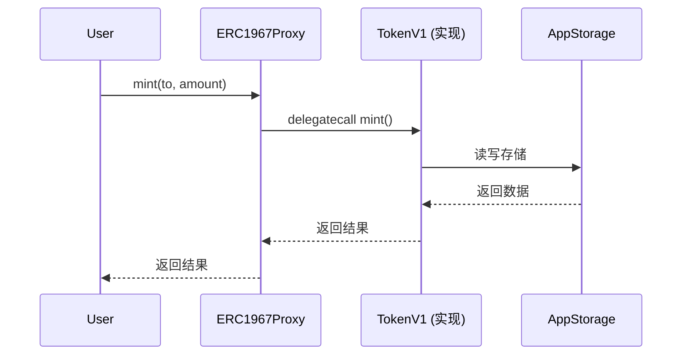

# Proxy 模式详解 (UUPS / EIP-1967)

本文档详细介绍 UUPS (Universal Upgradeable Proxy Standard) 代理模式的实现。

---

## 📖 什么是 UUPS Proxy？

UUPS 是一种可升级代理模式，符合 [EIP-1967](https://eips.ethereum.org/EIPS/eip-1967) 标准。与传统的 Transparent Proxy 不同，UUPS 将升级逻辑放在**实现合约**中，而不是代理合约中。

### 核心概念



**关键点**：
- 用户始终与 **Proxy** 交互
- Proxy 通过 `delegatecall` 调用实现合约
- 所有状态存储在 **Proxy** 的存储空间
- 实现合约是**无状态**的逻辑容器

---

## 🏗️ 架构组件

### 1. ERC1967Proxy - 代理合约

**文件**: [src/proxy/ERC1967Proxy.sol](file:///Users/benjamin/Library/Mobile%20Documents/com~apple~CloudDocs/Documents/github/foundry-upgradeable-storage-template/src/proxy/ERC1967Proxy.sol)

```solidity
contract ERC1967Proxy {
    // EIP-1967 标准存储槽
    bytes32 internal constant IMPLEMENTATION_SLOT = 
        0x360894a13ba1a3210667c828492db98dca3e2076cc3735a920a3ca505d382bbc;
    
    constructor(address implementation_, bytes memory data_) {
        _setImplementation(implementation_);
        if (data_.length > 0) {
            (bool ok, ) = implementation_.delegatecall(data_);
            require(ok, "init failed");
        }
    }
    
    fallback() external payable {
        _delegate();
    }
    
    function _delegate() internal {
        address impl = _implementation();
        assembly {
            calldatacopy(0, 0, calldatasize())
            let result := delegatecall(gas(), impl, 0, calldatasize(), 0, 0)
            returndatacopy(0, 0, returndatasize())
            switch result
            case 0 { revert(0, returndatasize()) }
            default { return(0, returndatasize()) }
        }
    }
}
```

**核心功能**：
- ✅ 存储实现合约地址（EIP-1967 标准槽位）
- ✅ 接收所有调用并委托给实现合约
- ✅ 支持构造时初始化

---

### 2. UUPSUpgradeable - 升级逻辑

**文件**: [src/proxy/UUPSUpgradeable.sol](file:///Users/benjamin/Library/Mobile%20Documents/com~apple~CloudDocs/Documents/github/foundry-upgradeable-storage-template/src/proxy/UUPSUpgradeable.sol)

```solidity
abstract contract UUPSUpgradeable {
    function upgradeTo(address newImplementation) external virtual {
        _authorizeUpgrade();
        assembly {
            // EIP-1967 标准槽位
            sstore(
                0x360894a13ba1a3210667c828492db98dca3e2076cc3735a920a3ca505d382bbc,
                newImplementation
            )
        }
    }
    
    function _authorizeUpgrade() internal virtual;
}
```

**核心功能**：
- ✅ 提供 `upgradeTo()` 函数
- ✅ 抽象的授权检查（由子类实现）
- ✅ 直接修改 EIP-1967 存储槽

**重要**：实现合约必须继承此抽象合约并实现 `_authorizeUpgrade()`。

---

### 3. AppStorage - 存储库

**文件**: [src/app/AppStorage.sol](file:///Users/benjamin/Library/Mobile%20Documents/com~apple~CloudDocs/Documents/github/foundry-upgradeable-storage-template/src/app/AppStorage.sol)

```solidity
library AppStorage {
    bytes32 internal constant STORAGE_SLOT = 
        keccak256("app.storage.v1");
    
    struct Layout {
        address owner;
        uint256 totalSupply;
        mapping(address => uint256) balances;
    }
    
    function layout() internal pure returns (Layout storage l) {
        bytes32 slot = STORAGE_SLOT;
        assembly {
            l.slot := slot
        }
    }
}
```

**核心功能**：
- ✅ 定义应用的存储结构
- ✅ 使用命名槽位避免冲突
- ✅ 提供访问存储的统一接口

---

### 4. TokenV1 - 实现合约示例

**文件**: [src/app/TokenV1.sol](file:///Users/benjamin/Library/Mobile%20Documents/com~apple~CloudDocs/Documents/github/foundry-upgradeable-storage-template/src/app/TokenV1.sol)

```solidity
contract TokenV1 is UUPSUpgradeable {
    function initialize(address owner_) external {
        AppStorage.Layout storage s = AppStorage.layout();
        require(s.owner == address(0), "already init");
        s.owner = owner_;
    }
    
    function mint(address to, uint256 amount) external {
        AppStorage.Layout storage s = AppStorage.layout();
        require(msg.sender == s.owner, "not owner");
        s.totalSupply += amount;
        s.balances[to] += amount;
    }
    
    function balanceOf(address user) external view returns (uint256) {
        return AppStorage.layout().balances[user];
    }
    
    function _authorizeUpgrade() internal view override {
        require(msg.sender == AppStorage.layout().owner, "not owner");
    }
}
```

**核心功能**：
- ✅ 实现业务逻辑
- ✅ 通过 `AppStorage.layout()` 访问存储
- ✅ 实现升级授权检查
- ✅ **不定义任何状态变量**

---

## 🔄 升级流程

### 部署和初始化

```solidity
// 1. 部署实现合约
TokenV1 implementation = new TokenV1();

// 2. 准备初始化数据
bytes memory initData = abi.encodeWithSelector(
    TokenV1.initialize.selector,
    owner
);

// 3. 部署代理
ERC1967Proxy proxy = new ERC1967Proxy(
    address(implementation),
    initData
);

// 4. 通过代理交互
TokenV1 token = TokenV1(address(proxy));
```

### 升级到 V2

```solidity
// 1. 部署新实现
TokenV2 newImplementation = new TokenV2();

// 2. 通过代理调用升级
TokenV1(address(proxy)).upgradeTo(address(newImplementation));

// 3. 现在代理指向 V2
TokenV2 token = TokenV2(address(proxy));
```

---

## 🔐 存储安全

### ✅ 正确做法：使用命名存储

```solidity
// AppStorage.sol - 存储定义
library AppStorage {
    bytes32 constant STORAGE_SLOT = keccak256("app.storage.v1");
    
    struct Layout {
        address owner;        // 字段 1
        uint256 totalSupply;  // 字段 2
    }
}

// TokenV2.sol - 安全升级
library AppStorageV2 {
    bytes32 constant STORAGE_SLOT = keccak256("app.storage.v1"); // 相同槽位
    
    struct Layout {
        address owner;        // 字段 1 - 保持不变
        uint256 totalSupply;  // 字段 2 - 保持不变
        uint256 maxSupply;    // 字段 3 - 新增字段 ✅
    }
}
```

### ❌ 错误做法：直接定义状态变量

```solidity
// ❌ 永远不要这样做！
contract TokenV1 {
    address public owner;      // slot 0
    uint256 public totalSupply; // slot 1
}

contract TokenV2 {
    uint256 public totalSupply; // slot 0 ⚠️ 冲突！
    address public owner;       // slot 1 ⚠️ 冲突！
}
```

---

## 📊 存储布局图

### 代理合约存储

```
Slot                                    Value
━━━━━━━━━━━━━━━━━━━━━━━━━━━━━━━━━━━━━━━━━━━━━━━━━━━━━━━━━━━
0x360894a1...                          [实现合约地址]
                                       (EIP-1967 标准槽位)

keccak256("app.storage.v1")            [AppStorage.Layout]
  ├─ offset 0                          owner (address)
  ├─ offset 1                          totalSupply (uint256)
  └─ offset 2                          balances (mapping)
```

### 实现合约存储

```
实现合约 (TokenV1) 没有任何状态变量！
所有状态都存储在代理合约的存储空间中。
```

---

## 🧪 测试策略

### 1. 存储布局测试

确保实现合约没有状态变量：

```solidity
function test_tokenV1_has_no_state_variables() public view {
    string memory json = vm.readFile("out/TokenV1.sol/TokenV1.json");
    bytes memory layoutBytes = vm.parseJson(json, ".storageLayout.storage");
    
    // 空数组的 ABI 编码是 64 字节
    assertEq(layoutBytes.length, 64, "TokenV1 defines state variables");
}
```

### 2. 升级测试

```solidity
function test_upgrade_requires_owner() public {
    // 部署 V1
    TokenV1 impl1 = new TokenV1();
    bytes memory initData = abi.encodeWithSelector(
        TokenV1.initialize.selector,
        owner
    );
    ERC1967Proxy proxy = new ERC1967Proxy(address(impl1), initData);
    TokenV1 token = TokenV1(address(proxy));
    
    // 部署 V2
    TokenV2 impl2 = new TokenV2();
    
    // 非 owner 升级应该失败
    vm.prank(user);
    vm.expectRevert("not owner");
    token.upgradeTo(address(impl2));
    
    // owner 升级应该成功
    vm.prank(owner);
    token.upgradeTo(address(impl2));
}
```

---

## ⚠️ 常见陷阱

### 1. 在实现合约中定义状态变量

```solidity
// ❌ 错误
contract TokenV1 is UUPSUpgradeable {
    address public owner; // 这会创建存储冲突！
}

// ✅ 正确
contract TokenV1 is UUPSUpgradeable {
    // 不定义状态变量，只通过 AppStorage 访问
}
```

### 2. 忘记实现 _authorizeUpgrade

```solidity
// ❌ 错误 - 任何人都可以升级
contract TokenV1 is UUPSUpgradeable {
    function _authorizeUpgrade() internal view override {
        // 空实现 = 没有授权检查！
    }
}

// ✅ 正确
contract TokenV1 is UUPSUpgradeable {
    function _authorizeUpgrade() internal view override {
        require(msg.sender == AppStorage.layout().owner, "not owner");
    }
}
```

### 3. 使用 constructor 初始化

```solidity
// ❌ 错误 - constructor 在实现合约中执行，不影响代理
contract TokenV1 is UUPSUpgradeable {
    constructor(address owner) {
        AppStorage.layout().owner = owner; // 这不会生效！
    }
}

// ✅ 正确 - 使用 initialize 函数
contract TokenV1 is UUPSUpgradeable {
    function initialize(address owner) external {
        AppStorage.layout().owner = owner;
    }
}
```

---

## 🔗 相关资源

- [EIP-1967 规范](https://eips.ethereum.org/EIPS/eip-1967)
- [OpenZeppelin UUPS 文档](https://docs.openzeppelin.com/contracts/4.x/api/proxy#UUPSUpgradeable)
- [存储模式指南](guides/storage-patterns.md)
- [升级指南](guides/upgrading-contracts.md)

---

## 📝 下一步

- 查看 [Diamond 模式](03-diamond-pattern.md) 了解另一种架构
- 阅读 [API 参考](api/proxy-contracts.md) 了解详细接口
- 学习 [如何升级](guides/upgrading-contracts.md) 实践升级流程
