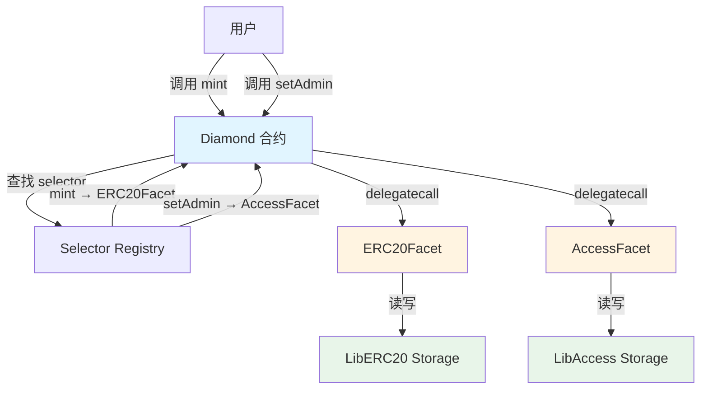

# Diamond 模式详解 (EIP-2535)

本文档详细介绍 Diamond 模式的实现，这是一种高级的可升级合约架构。

---

## 📖 什么是 Diamond Pattern？

Diamond 模式是 [EIP-2535](https://eips.ethereum.org/EIPS/eip-2535) 定义的一种模块化智能合约架构。它允许：

- 🔹 **突破 24KB 合约大小限制**
- 🔹 **模块化功能**（称为 facets）
- 🔹 **独立升级各个模块**
- 🔹 **完全的存储隔离**

### 核心概念



**关键点**：
- Diamond 是单一入口点
- 每个 facet 处理特定功能
- 每个 facet 有独立的存储命名空间
- 通过 selector 映射路由调用

---

## 🏗️ 架构组件

### 1. Diamond - 主合约

**文件**: [src/diamond/Diamond.sol](file:///Users/benjamin/Library/Mobile%20Documents/com~apple~CloudDocs/Documents/github/foundry-upgradeable-storage-template/src/diamond/Diamond.sol)

```solidity
contract Diamond {
    constructor(address owner_) {
        LibDiamond.setOwner(owner_);
    }
    
    fallback() external payable {
        address facet = LibDiamond.facetOf(msg.sig);
        require(facet != address(0), "facet not found");
        
        assembly {
            calldatacopy(0, 0, calldatasize())
            let result := delegatecall(gas(), facet, 0, calldatasize(), 0, 0)
            returndatacopy(0, 0, returndatasize())
            switch result
            case 0 { revert(0, returndatasize()) }
            default { return(0, returndatasize()) }
        }
    }
}
```

**核心功能**：
- ✅ 接收所有调用
- ✅ 根据 function selector 查找对应 facet
- ✅ 委托调用到正确的 facet

---

### 2. LibDiamond - Diamond 存储库

**文件**: [src/diamond/storage/LibDiamond.sol](file:///Users/benjamin/Library/Mobile%20Documents/com~apple~CloudDocs/Documents/github/foundry-upgradeable-storage-template/src/diamond/storage/LibDiamond.sol)

```solidity
library LibDiamond {
    bytes32 internal constant DIAMOND_STORAGE_POSITION =
        keccak256("diamond.standard.diamond.storage");
    
    struct DiamondStorage {
        mapping(bytes4 => address) selectorToFacet;
        address owner;
    }
    
    function diamondStorage() internal pure returns (DiamondStorage storage ds) {
        bytes32 pos = DIAMOND_STORAGE_POSITION;
        assembly {
            ds.slot := pos
        }
    }
    
    function setFacet(bytes4 selector, address facet) internal {
        diamondStorage().selectorToFacet[selector] = facet;
    }
    
    function facetOf(bytes4 selector) internal view returns (address) {
        return diamondStorage().selectorToFacet[selector];
    }
}
```

**核心功能**：
- ✅ 存储 selector → facet 映射
- ✅ 存储 Diamond 所有者
- ✅ 提供 facet 注册和查询接口

---

### 3. Facets - 功能模块

#### ERC20Facet

**文件**: [src/diamond/facets/ERC20Facet.sol](file:///Users/benjamin/Library/Mobile%20Documents/com~apple~CloudDocs/Documents/github/foundry-upgradeable-storage-template/src/diamond/facets/ERC20Facet.sol)

```solidity
contract ERC20Facet {
    function mint(address to, uint256 amount) external {
        require(msg.sender == LibDiamond.owner(), "not owner");
        
        LibERC20.Layout storage s = LibERC20.layout();
        s.totalSupply += amount;
        s.balanceOf[to] += amount;
    }
    
    function balanceOf(address user) external view returns (uint256) {
        return LibERC20.layout().balanceOf[user];
    }
}
```

#### AccessFacet

**文件**: [src/diamond/facets/AccessFacet.sol](file:///Users/benjamin/Library/Mobile%20Documents/com~apple~CloudDocs/Documents/github/foundry-upgradeable-storage-template/src/diamond/facets/AccessFacet.sol)

```solidity
contract AccessFacet {
    function setAdmin(address user, bool ok) external {
        require(msg.sender == LibDiamond.owner(), "not owner");
        LibAccess.layout().admins[user] = ok;
    }
    
    function isAdmin(address user) external view returns (bool) {
        return LibAccess.layout().admins[user];
    }
}
```

#### DiamondManagementFacet

**文件**: [src/diamond/facets/DiamondManagementFacet.sol](file:///Users/benjamin/Library/Mobile%20Documents/com~apple~CloudDocs/Documents/github/foundry-upgradeable-storage-template/src/diamond/facets/DiamondManagementFacet.sol)

```solidity
contract DiamondManagementFacet {
    function setFacet(bytes4 selector, address facet) external {
        require(msg.sender == LibDiamond.owner(), "not owner");
        LibDiamond.setFacet(selector, facet);
    }
    
    function getFacet(bytes4 selector) external view returns (address) {
        return LibDiamond.facetOf(selector);
    }
}
```

**重要**：所有 facets 都**不定义状态变量**，只包含业务逻辑。

---

### 4. Storage Libraries - 存储库

#### LibERC20

**文件**: [src/diamond/storage/LibERC20.sol](file:///Users/benjamin/Library/Mobile%20Documents/com~apple~CloudDocs/Documents/github/foundry-upgradeable-storage-template/src/diamond/storage/LibERC20.sol)

```solidity
library LibERC20 {
    bytes32 internal constant STORAGE_POSITION =
        keccak256("diamond.erc20.storage");
    
    struct Layout {
        uint256 totalSupply;
        mapping(address => uint256) balanceOf;
    }
    
    function layout() internal pure returns (Layout storage l) {
        bytes32 pos = STORAGE_POSITION;
        assembly {
            l.slot := pos
        }
    }
}
```

#### LibAccess

**文件**: [src/diamond/storage/LibAccess.sol](file:///Users/benjamin/Library/Mobile%20Documents/com~apple~CloudDocs/Documents/github/foundry-upgradeable-storage-template/src/diamond/storage/LibAccess.sol)

```solidity
library LibAccess {
    bytes32 internal constant STORAGE_POSITION =
        keccak256("diamond.access.storage");
    
    struct Layout {
        mapping(address => bool) admins;
    }
    
    function layout() internal pure returns (Layout storage l) {
        bytes32 pos = STORAGE_POSITION;
        assembly {
            l.slot := pos
        }
    }
}
```

---

## 🔄 Facet 管理流程

### 部署和注册

```solidity
// 1. 部署 Diamond
Diamond diamond = new Diamond(owner);

// 2. 部署 facets
ERC20Facet erc20Facet = new ERC20Facet();
AccessFacet accessFacet = new AccessFacet();
DiamondManagementFacet mgmtFacet = new DiamondManagementFacet();

// 3. 注册 facets（通过管理接口）
DiamondManagementFacet(address(diamond)).setFacet(
    ERC20Facet.mint.selector,
    address(erc20Facet)
);

DiamondManagementFacet(address(diamond)).setFacet(
    AccessFacet.setAdmin.selector,
    address(accessFacet)
);
```

### 使用 Diamond

```solidity
// 通过 Diamond 地址调用任何 facet 的函数
ERC20Facet(address(diamond)).mint(user, 100);
AccessFacet(address(diamond)).setAdmin(admin, true);
```

### 升级 Facet

```solidity
// 1. 部署新版本 facet
ERC20FacetV2 newERC20Facet = new ERC20FacetV2();

// 2. 更新 selector 映射
DiamondManagementFacet(address(diamond)).setFacet(
    ERC20Facet.mint.selector,
    address(newERC20Facet)
);

// 3. 现在 mint 调用会路由到 V2
ERC20FacetV2(address(diamond)).mint(user, 100);
```

---

## 📊 存储布局

### Diamond 存储空间

```
Slot                                    Value
━━━━━━━━━━━━━━━━━━━━━━━━━━━━━━━━━━━━━━━━━━━━━━━━━━━━━━━━━━━

keccak256("diamond.standard.diamond.storage")
  ├─ offset 0                          selectorToFacet (mapping)
  │   ├─ mint.selector                 → ERC20Facet 地址
  │   ├─ balanceOf.selector            → ERC20Facet 地址
  │   ├─ setAdmin.selector             → AccessFacet 地址
  │   └─ isAdmin.selector              → AccessFacet 地址
  └─ offset 1                          owner (address)

keccak256("diamond.erc20.storage")
  ├─ offset 0                          totalSupply (uint256)
  └─ offset 1                          balanceOf (mapping)

keccak256("diamond.access.storage")
  └─ offset 0                          admins (mapping)
```

**关键点**：
- 每个存储库使用独立的命名空间
- 不同 facets 的存储完全隔离
- 不会发生存储冲突

---

## 🔐 存储隔离优势

### 命名空间隔离

```solidity
// LibERC20 使用自己的命名空间
bytes32 constant ERC20_STORAGE = keccak256("diamond.erc20.storage");

// LibAccess 使用不同的命名空间
bytes32 constant ACCESS_STORAGE = keccak256("diamond.access.storage");

// 两者永远不会冲突！
assert(ERC20_STORAGE != ACCESS_STORAGE);
```

### 独立升级

```solidity
// 升级 ERC20Facet 不影响 AccessFacet
// 因为它们使用不同的存储命名空间

// V1: LibERC20
struct Layout {
    uint256 totalSupply;
    mapping(address => uint256) balanceOf;
}

// V2: LibERC20 - 安全添加字段
struct Layout {
    uint256 totalSupply;
    mapping(address => uint256) balanceOf;
    uint256 maxSupply;  // 新字段 ✅
}
```

---

## 🧪 测试策略

### 1. Facet 无状态测试

```solidity
function test_facets_have_no_state_variables() public view {
    string[2] memory facets = ["ERC20Facet", "AccessFacet"];
    
    for (uint256 i = 0; i < facets.length; i++) {
        string memory json = vm.readFile(
            string.concat("out/", facets[i], ".sol/", facets[i], ".json")
        );
        bytes memory layoutBytes = vm.parseJson(json, ".storageLayout.storage");
        
        // 确保 facet 没有状态变量
        assertEq(layoutBytes.length, 64, "Facet has state variables");
    }
}
```

### 2. 命名空间唯一性测试

```solidity
function test_unique_storage_namespaces() public {
    bytes32 diamond = keccak256("diamond.standard.diamond.storage");
    bytes32 erc20 = keccak256("diamond.erc20.storage");
    bytes32 access = keccak256("diamond.access.storage");
    
    assert(diamond != erc20);
    assert(diamond != access);
    assert(erc20 != access);
}
```

### 3. Facet 调用测试

```solidity
function test_mint_via_diamond() public {
    // 通过 Diamond 调用 ERC20Facet
    ERC20Facet d = ERC20Facet(address(diamond));
    
    vm.prank(owner);
    d.mint(user, 50);
    
    assertEq(d.balanceOf(user), 50);
}
```

---

## ⚙️ Diamond vs Proxy 对比

| 特性 | Diamond | UUPS Proxy |
|------|---------|-----------|
| **合约大小** | 无限制 | 24KB |
| **模块化** | 是（多个 facets） | 否（单一实现） |
| **升级粒度** | 单个 facet | 整个实现 |
| **存储命名空间** | 多个独立命名空间 | 单一命名空间 |
| **复杂度** | 高 | 低 |
| **Gas 成本** | 中等（selector 查找） | 低 |
| **适用场景** | 大型复杂系统 | 简单应用 |

---

## ⚠️ 常见陷阱

### 1. Facet 中定义状态变量

```solidity
// ❌ 错误
contract ERC20Facet {
    uint256 public totalSupply; // 这会破坏存储隔离！
}

// ✅ 正确
contract ERC20Facet {
    // 不定义状态变量，只通过 LibERC20 访问
}
```

### 2. 忘记注册 selector

```solidity
// ❌ 错误 - 忘记注册新函数
contract ERC20FacetV2 {
    function burn(address from, uint256 amount) external {
        // 新函数
    }
}

// ✅ 正确 - 记得注册
DiamondManagementFacet(diamond).setFacet(
    ERC20FacetV2.burn.selector,
    address(newFacet)
);
```

### 3. Selector 冲突

```solidity
// ❌ 错误 - 两个 facets 有相同的 selector
contract FacetA {
    function transfer(address to, uint256 amount) external {} // selector: 0xa9059cbb
}

contract FacetB {
    function transfer(address to, uint256 amount) external {} // 相同 selector！
}

// 只有一个会被注册，另一个会被覆盖
```

---

## 🎯 最佳实践

### 1. 使用描述性的命名空间

```solidity
// ✅ 好的命名空间
keccak256("myapp.erc20.storage.v1")
keccak256("myapp.governance.storage.v1")

// ❌ 不好的命名空间
keccak256("storage1")
keccak256("storage2")
```

### 2. 为每个功能域创建独立的存储库

```solidity
// ✅ 好的设计
LibERC20.sol    - ERC20 相关存储
LibAccess.sol   - 访问控制存储
LibGovernance.sol - 治理相关存储

// ❌ 不好的设计
LibStorage.sol  - 所有存储混在一起
```

### 3. 文档化 Selector 映射

```solidity
// 在部署脚本中记录所有 selector 映射
// ERC20Facet
setFacet(0xa9059cbb, erc20Facet); // transfer
setFacet(0x40c10f19, erc20Facet); // mint
setFacet(0x70a08231, erc20Facet); // balanceOf
```

---

## 🔗 相关资源

- [EIP-2535 规范](https://eips.ethereum.org/EIPS/eip-2535)
- [Diamond 官方实现](https://github.com/mudgen/diamond)
- [存储模式指南](guides/storage-patterns.md)
- [升级指南](guides/upgrading-contracts.md)

---

## 📝 下一步

- 查看 [Proxy 模式](02-proxy-pattern.md) 了解更简单的架构
- 阅读 [API 参考](api/diamond-contracts.md) 了解详细接口
- 学习 [存储模式](guides/storage-patterns.md) 深入理解存储隔离
