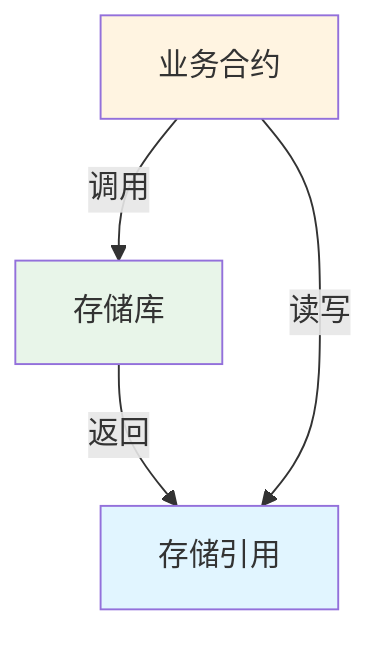

# 存储模式指南

本指南深入讲解可升级合约中的存储模式和最佳实践。

---

## 🎯 核心问题

可升级合约最大的挑战是**存储布局兼容性**。错误的存储管理会导致：

- 💥 数据损坏
- 💥 资金丢失
- 💥 合约功能失效

---

## 📐 存储布局基础

### Solidity 存储规则

Solidity 按声明顺序分配存储槽：

```solidity
contract Example {
    uint256 a;  // slot 0
    address b;  // slot 1
    bool c;     // slot 2
}
```

### ❌ 升级陷阱

```solidity
// V1
contract TokenV1 {
    address owner;      // slot 0
    uint256 totalSupply; // slot 1
}

// V2 - 错误！改变了顺序
contract TokenV2 {
    uint256 totalSupply; // slot 0 ⚠️ 现在是 owner 的数据！
    address owner;       // slot 1 ⚠️ 现在是 totalSupply 的数据！
}
```

**结果**: 数据完全错乱！

---

## 🔐 命名存储模式 (Named Storage)

### 基本概念

使用 keccak256 哈希确定存储位置，而不是依赖声明顺序：

```solidity
library AppStorage {
    // 唯一的命名空间
    bytes32 internal constant STORAGE_SLOT = 
        keccak256("app.storage.v1");
    
    struct Layout {
        address owner;
        uint256 totalSupply;
        mapping(address => uint256) balances;
    }
    
    function layout() internal pure returns (Layout storage l) {
        bytes32 slot = STORAGE_SLOT;
        assembly {
            l.slot := slot
        }
    }
}
```

### 优势

✅ **位置固定**: 存储位置由哈希值决定，不受变量顺序影响
✅ **命名空间隔离**: 不同库使用不同哈希，永不冲突
✅ **升级安全**: 只需修改 Layout 结构体

---

## 🏗️ 存储库模式 (Storage Library Pattern)

### 模式结构



### 实现示例

```solidity
// 1. 定义存储库
library LibERC20 {
    bytes32 constant STORAGE_POSITION = keccak256("diamond.erc20.storage");
    
    struct Layout {
        uint256 totalSupply;
        mapping(address => uint256) balanceOf;
        mapping(address => mapping(address => uint256)) allowance;
    }
    
    function layout() internal pure returns (Layout storage l) {
        bytes32 pos = STORAGE_POSITION;
        assembly {
            l.slot := pos
        }
    }
}

// 2. 在合约中使用
contract ERC20Facet {
    function mint(address to, uint256 amount) external {
        LibERC20.Layout storage s = LibERC20.layout();
        s.totalSupply += amount;
        s.balanceOf[to] += amount;
    }
    
    function balanceOf(address user) external view returns (uint256) {
        return LibERC20.layout().balanceOf[user];
    }
}
```

---

## 🔄 安全升级模式

### ✅ 正确: 只添加字段

```solidity
// V1
library AppStorageV1 {
    bytes32 constant SLOT = keccak256("app.storage.v1");
    
    struct Layout {
        address owner;        // 字段 1
        uint256 totalSupply;  // 字段 2
    }
}

// V2 - 安全升级
library AppStorageV2 {
    bytes32 constant SLOT = keccak256("app.storage.v1"); // 相同槽位！
    
    struct Layout {
        address owner;        // 字段 1 - 保持不变
        uint256 totalSupply;  // 字段 2 - 保持不变
        uint256 maxSupply;    // 字段 3 - 新增 ✅
        bool paused;          // 字段 4 - 新增 ✅
    }
}
```

### ❌ 错误: 修改或删除字段

```solidity
// V1
struct Layout {
    address owner;
    uint256 totalSupply;
}

// V2 - 危险！
struct Layout {
    uint256 totalSupply;  // ❌ 改变了顺序
    address owner;
}

// V3 - 危险！
struct Layout {
    address owner;
    // ❌ 删除了 totalSupply
    uint256 maxSupply;
}
```

---

## 🎨 多命名空间模式

### Diamond 中的存储隔离

```solidity
// 每个功能模块使用独立命名空间

// ERC20 存储
library LibERC20 {
    bytes32 constant STORAGE = keccak256("diamond.erc20.storage");
    struct Layout {
        uint256 totalSupply;
        mapping(address => uint256) balanceOf;
    }
}

// 访问控制存储
library LibAccess {
    bytes32 constant STORAGE = keccak256("diamond.access.storage");
    struct Layout {
        mapping(address => bool) admins;
        mapping(bytes32 => bool) roles;
    }
}

// 治理存储
library LibGovernance {
    bytes32 constant STORAGE = keccak256("diamond.governance.storage");
    struct Layout {
        uint256 proposalCount;
        mapping(uint256 => Proposal) proposals;
    }
}
```

### 命名空间验证

```solidity
function test_unique_namespaces() public {
    bytes32 erc20 = keccak256("diamond.erc20.storage");
    bytes32 access = keccak256("diamond.access.storage");
    bytes32 gov = keccak256("diamond.governance.storage");
    
    // 确保所有命名空间唯一
    assert(erc20 != access);
    assert(erc20 != gov);
    assert(access != gov);
}
```

---

## 📊 存储槽位计算

### 基本类型

```solidity
// 简单变量
bytes32 slot = keccak256("my.storage");
// 值直接存储在 slot 位置
```

### Mapping

```solidity
// mapping(address => uint256) balances
bytes32 baseSlot = keccak256("my.storage");
bytes32 userSlot = keccak256(abi.encode(userAddress, baseSlot));
// 用户余额存储在 userSlot
```

### 嵌套 Mapping

```solidity
// mapping(address => mapping(address => uint256)) allowance
bytes32 baseSlot = keccak256("my.storage");
bytes32 ownerSlot = keccak256(abi.encode(owner, baseSlot));
bytes32 spenderSlot = keccak256(abi.encode(spender, ownerSlot));
// 授权额度存储在 spenderSlot
```

---

## 🧪 存储布局测试

### 检测状态变量

```solidity
function test_no_state_variables() public view {
    string memory json = vm.readFile("out/TokenV1.sol/TokenV1.json");
    bytes memory layoutBytes = vm.parseJson(json, ".storageLayout.storage");
    
    // 空数组的 ABI 编码是 64 字节（32 字节偏移 + 32 字节长度）
    assertEq(layoutBytes.length, 64, "Contract has state variables");
}
```

### 验证存储位置

```solidity
function test_storage_slot_position() public {
    bytes32 expected = keccak256("app.storage.v1");
    bytes32 actual = AppStorage.STORAGE_SLOT;
    assertEq(actual, expected, "Storage slot mismatch");
}
```

---

## 🎯 最佳实践

### 1. 使用描述性命名空间

```solidity
// ✅ 好的命名
keccak256("myproject.erc20.storage.v1")
keccak256("myproject.governance.storage.v1")

// ❌ 不好的命名
keccak256("storage")
keccak256("data")
```

### 2. 版本化存储

```solidity
// 如果需要完全重构存储，使用新版本
bytes32 constant STORAGE_V1 = keccak256("app.storage.v1");
bytes32 constant STORAGE_V2 = keccak256("app.storage.v2");

// 提供迁移函数
function migrateToV2() external {
    LayoutV1 storage oldStorage = layoutV1();
    LayoutV2 storage newStorage = layoutV2();
    
    newStorage.owner = oldStorage.owner;
    newStorage.totalSupply = oldStorage.totalSupply;
    // ...
}
```

### 3. 文档化存储结构

```solidity
/**
 * @title AppStorage
 * @notice 应用层存储库
 * @dev 使用命名槽位: keccak256("app.storage.v1")
 * 
 * 存储布局:
 * - slot 0: owner (address)
 * - slot 1: totalSupply (uint256)
 * - slot 2: balances (mapping)
 * 
 * 升级规则:
 * - 只能在末尾添加新字段
 * - 不能修改或删除现有字段
 * - 不能改变字段顺序
 */
library AppStorage {
    // ...
}
```

### 4. 避免在实现合约中定义状态变量

```solidity
// ❌ 错误
contract TokenV1 is UUPSUpgradeable {
    address public owner;  // 这会创建存储冲突！
}

// ✅ 正确
contract TokenV1 is UUPSUpgradeable {
    // 不定义状态变量
    // 只通过 AppStorage.layout() 访问存储
}
```

### 5. 使用常量而非魔法数字

```solidity
// ❌ 不好
bytes32 slot = 0x192a690e50e93051469e068c8585461ed5b81a8b3e83921789c670a4401cf07e;

// ✅ 好
bytes32 constant STORAGE_SLOT = keccak256("app.storage.v1");
```

---

## ⚠️ 常见陷阱

### 1. 忘记使用相同的槽位标识符

```solidity
// V1
bytes32 constant SLOT = keccak256("app.storage.v1");

// V2 - 错误！使用了不同的标识符
bytes32 constant SLOT = keccak256("app.storage.v2"); // ❌
```

### 2. 在结构体中间插入字段

```solidity
// V1
struct Layout {
    address owner;
    uint256 totalSupply;
}

// V2 - 错误！
struct Layout {
    address owner;
    bool paused;        // ❌ 插入在中间
    uint256 totalSupply;
}
```

### 3. 改变字段类型

```solidity
// V1
struct Layout {
    uint256 totalSupply;
}

// V2 - 错误！
struct Layout {
    uint128 totalSupply; // ❌ 改变了类型
}
```

---

## 📝 检查清单

升级前检查：

- [ ] 新字段只添加在末尾
- [ ] 没有修改现有字段类型
- [ ] 没有删除现有字段
- [ ] 没有改变字段顺序
- [ ] 使用相同的存储槽位标识符
- [ ] 运行存储布局测试
- [ ] 文档已更新

---

## 🔗 相关资源

- [架构概览](../01-architecture-overview.md)
- [Proxy 模式](../02-proxy-pattern.md)
- [Diamond 模式](../03-diamond-pattern.md)
- [升级指南](upgrading-contracts.md)
- [测试指南](testing.md)
