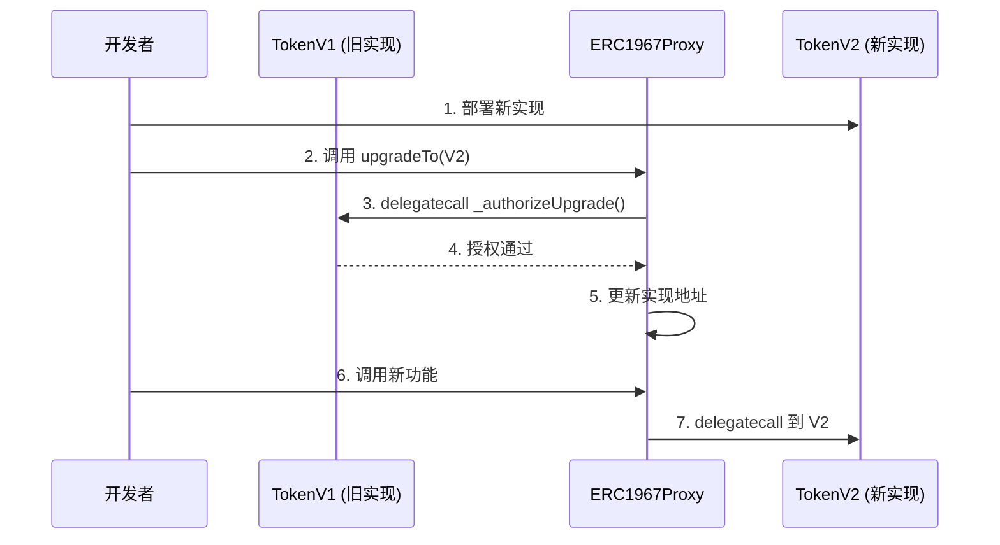

# 合约升级指南

本指南介绍如何安全地升级 UUPS Proxy 和 Diamond 合约。

---

## 🎯 升级原则

### 核心规则

1. ✅ **只在末尾添加字段** - 不要修改现有字段
2. ✅ **保持字段顺序** - 不要重新排列
3. ✅ **保持字段类型** - 不要改变类型
4. ✅ **测试充分** - 在升级前全面测试
5. ✅ **备份数据** - 在主网升级前备份

---

## 🔄 UUPS Proxy 升级

### 升级流程



### 步骤详解

#### 1. 创建新实现合约

```solidity
// TokenV2.sol
contract TokenV2 is UUPSUpgradeable {
    // 使用相同的存储库
    function mint(address to, uint256 amount) external {
        AppStorage.Layout storage s = AppStorage.layout();
        require(msg.sender == s.owner, "not owner");
        s.totalSupply += amount;
        s.balances[to] += amount;
    }
    
    // 新功能
    function burn(address from, uint256 amount) external {
        AppStorage.Layout storage s = AppStorage.layout();
        require(msg.sender == s.owner, "not owner");
        require(s.balances[from] >= amount, "insufficient balance");
        s.totalSupply -= amount;
        s.balances[from] -= amount;
    }
    
    function _authorizeUpgrade() internal view override {
        require(msg.sender == AppStorage.layout().owner, "not owner");
    }
}
```

#### 2. 更新存储库（如需要）

```solidity
// AppStorage.sol - V2
library AppStorage {
    bytes32 internal constant STORAGE_SLOT = 
        keccak256("app.storage.v1"); // 相同的槽位！
    
    struct Layout {
        address owner;        // 字段 1 - 保持不变
        uint256 totalSupply;  // 字段 2 - 保持不变
        mapping(address => uint256) balances; // 字段 3 - 保持不变
        uint256 maxSupply;    // 字段 4 - 新增 ✅
        bool paused;          // 字段 5 - 新增 ✅
    }
    
    function layout() internal pure returns (Layout storage l) {
        bytes32 slot = STORAGE_SLOT;
        assembly {
            l.slot := slot
        }
    }
}
```

#### 3. 测试升级

```solidity
contract UpgradeTest is Test {
    ERC1967Proxy proxy;
    TokenV1 tokenV1;
    
    address owner = address(0xCAFE);
    address user = address(0xBEEF);
    
    function setUp() public {
        // 部署 V1
        TokenV1 impl1 = new TokenV1();
        bytes memory initData = abi.encodeWithSelector(
            TokenV1.initialize.selector,
            owner
        );
        proxy = new ERC1967Proxy(address(impl1), initData);
        tokenV1 = TokenV1(address(proxy));
    }
    
    function test_upgrade_preserves_data() public {
        // 在 V1 中设置数据
        vm.prank(owner);
        tokenV1.mint(user, 1000);
        
        uint256 balanceBefore = tokenV1.balanceOf(user);
        
        // 升级到 V2
        TokenV2 impl2 = new TokenV2();
        vm.prank(owner);
        tokenV1.upgradeTo(address(impl2));
        
        // 验证数据保留
        TokenV2 tokenV2 = TokenV2(address(proxy));
        assertEq(tokenV2.balanceOf(user), balanceBefore);
    }
    
    function test_new_function_works() public {
        // 升级到 V2
        TokenV2 impl2 = new TokenV2();
        vm.prank(owner);
        tokenV1.upgradeTo(address(impl2));
        
        TokenV2 tokenV2 = TokenV2(address(proxy));
        
        // 测试新功能
        vm.prank(owner);
        tokenV2.mint(user, 1000);
        
        vm.prank(owner);
        tokenV2.burn(user, 500);
        
        assertEq(tokenV2.balanceOf(user), 500);
    }
}
```

#### 4. 部署和升级

```solidity
// 部署脚本
contract UpgradeScript is Script {
    function run() external {
        address proxyAddress = vm.envAddress("PROXY_ADDRESS");
        
        vm.startBroadcast();
        
        // 1. 部署新实现
        TokenV2 newImplementation = new TokenV2();
        console.log("New implementation:", address(newImplementation));
        
        // 2. 升级代理
        TokenV1 token = TokenV1(proxyAddress);
        token.upgradeTo(address(newImplementation));
        
        // 3. 验证升级
        TokenV2 tokenV2 = TokenV2(proxyAddress);
        // 调用新功能确认升级成功
        
        vm.stopBroadcast();
    }
}
```

---

## 💎 Diamond 升级

### 升级流程

Diamond 模式允许更细粒度的升级：

1. **升级单个 facet** - 只更新特定功能
2. **添加新 facet** - 扩展功能
3. **删除 facet** - 移除功能

### 升级单个 Facet

```solidity
// 1. 部署新版本 facet
ERC20FacetV2 newERC20Facet = new ERC20FacetV2();

// 2. 更新 selector 映射
DiamondManagementFacet(diamond).setFacet(
    ERC20Facet.mint.selector,
    address(newERC20Facet)
);

DiamondManagementFacet(diamond).setFacet(
    ERC20Facet.balanceOf.selector,
    address(newERC20Facet)
);

// 3. 如果有新函数，也要注册
DiamondManagementFacet(diamond).setFacet(
    ERC20FacetV2.burn.selector,
    address(newERC20Facet)
);
```

### 添加新 Facet

```solidity
// 1. 创建新存储库
library LibGovernance {
    bytes32 constant STORAGE = keccak256("diamond.governance.storage");
    
    struct Layout {
        uint256 proposalCount;
        mapping(uint256 => Proposal) proposals;
    }
    
    function layout() internal pure returns (Layout storage l) {
        bytes32 pos = STORAGE;
        assembly { l.slot := pos }
    }
}

// 2. 创建新 facet
contract GovernanceFacet {
    function createProposal(bytes memory data) external returns (uint256) {
        LibGovernance.Layout storage s = LibGovernance.layout();
        uint256 id = s.proposalCount++;
        s.proposals[id] = Proposal({...});
        return id;
    }
}

// 3. 部署并注册
GovernanceFacet govFacet = new GovernanceFacet();
DiamondManagementFacet(diamond).setFacet(
    GovernanceFacet.createProposal.selector,
    address(govFacet)
);
```

### 更新存储库

```solidity
// LibERC20.sol - V2
library LibERC20 {
    bytes32 constant STORAGE = keccak256("diamond.erc20.storage"); // 相同！
    
    struct Layout {
        uint256 totalSupply;                    // 字段 1 - 保持
        mapping(address => uint256) balanceOf;  // 字段 2 - 保持
        uint256 maxSupply;                      // 字段 3 - 新增 ✅
    }
    
    function layout() internal pure returns (Layout storage l) {
        bytes32 pos = STORAGE;
        assembly { l.slot := pos }
    }
}
```

---

## ⚠️ 升级陷阱

### 1. 改变存储布局

```solidity
// ❌ 错误 - 改变了字段顺序
// V1
struct Layout {
    address owner;
    uint256 totalSupply;
}

// V2
struct Layout {
    uint256 totalSupply;  // ❌ 顺序改变
    address owner;
}
```

### 2. 使用不同的槽位标识符

```solidity
// ❌ 错误
// V1
bytes32 constant SLOT = keccak256("app.storage.v1");

// V2
bytes32 constant SLOT = keccak256("app.storage.v2"); // ❌ 不同的槽位
```

### 3. 忘记测试数据保留

```solidity
// ✅ 正确 - 测试数据保留
function test_upgrade_preserves_data() public {
    // 设置数据
    token.mint(user, 1000);
    
    // 升级
    token.upgradeTo(newImpl);
    
    // 验证数据
    assertEq(token.balanceOf(user), 1000);
}
```

---

## 📝 升级检查清单

### 升级前

- [ ] 新实现合约已编写并编译
- [ ] 存储布局兼容性已验证
- [ ] 所有测试通过
- [ ] Gas 成本已评估
- [ ] 安全审计已完成（生产环境）
- [ ] 升级脚本已准备
- [ ] 回滚计划已制定

### 升级中

- [ ] 在测试网部署并测试
- [ ] 验证新实现合约
- [ ] 执行升级交易
- [ ] 验证升级成功
- [ ] 测试新功能
- [ ] 验证旧数据完整

### 升级后

- [ ] 监控合约行为
- [ ] 检查事件日志
- [ ] 验证用户交互
- [ ] 更新文档
- [ ] 通知用户

---

## 🛡️ 安全最佳实践

### 1. 使用多签钱包

```solidity
// 使用 Gnosis Safe 或类似的多签钱包作为 owner
address constant MULTISIG = 0x...;

function _authorizeUpgrade() internal view override {
    require(msg.sender == MULTISIG, "not multisig");
}
```

### 2. 添加时间锁

```solidity
library AppStorage {
    struct Layout {
        address owner;
        uint256 totalSupply;
        mapping(address => uint256) balances;
        
        // 升级时间锁
        address pendingImplementation;
        uint256 upgradeTimestamp;
    }
}

contract TokenV2 is UUPSUpgradeable {
    uint256 constant TIMELOCK_DURATION = 2 days;
    
    function proposeUpgrade(address newImpl) external {
        AppStorage.Layout storage s = AppStorage.layout();
        require(msg.sender == s.owner, "not owner");
        
        s.pendingImplementation = newImpl;
        s.upgradeTimestamp = block.timestamp + TIMELOCK_DURATION;
    }
    
    function executeUpgrade() external {
        AppStorage.Layout storage s = AppStorage.layout();
        require(msg.sender == s.owner, "not owner");
        require(block.timestamp >= s.upgradeTimestamp, "timelock");
        
        _upgradeTo(s.pendingImplementation);
    }
}
```

### 3. 添加紧急暂停

```solidity
function pause() external {
    require(msg.sender == owner, "not owner");
    AppStorage.layout().paused = true;
}

modifier whenNotPaused() {
    require(!AppStorage.layout().paused, "paused");
    _;
}
```

---

## 🔗 相关资源

- [存储模式指南](storage-patterns.md)
- [测试指南](testing.md)
- [Proxy 模式](../02-proxy-pattern.md)
- [Diamond 模式](../03-diamond-pattern.md)
